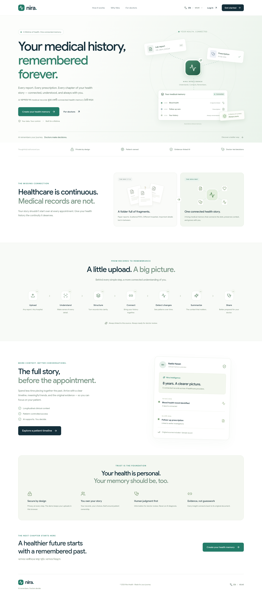
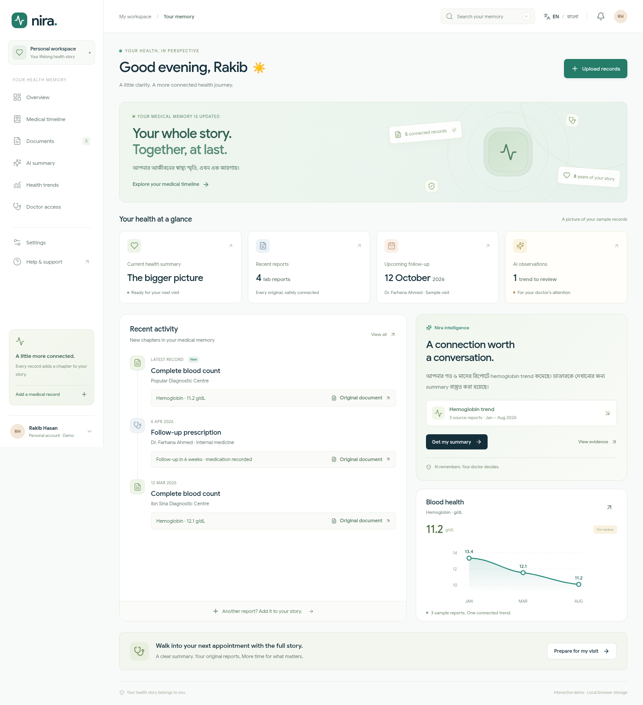

# Nira — longitudinal medical memory

**AI remembers the patient's medical journey. Doctors make decisions.**

A responsive, bilingual healthcare product built with Next.js App Router, React, TypeScript, Lucide icons, locally bundled Google Sans, and Noto Sans Bengali.

## Visual preview

The public demo is prepared for **https://neha-hub-maker.github.io/AI-builders/**.
If the site is not available yet, open the repository's **Settings → Pages** and choose **Deploy from a branch → gh-pages → / (root)**, then Save. GitHub may take a few minutes to publish.




More previews: [Upload experience](docs/screenshots/upload.png) · [Medical timeline](docs/screenshots/timeline.png).

### Publish updates

```bash
npm run deploy:pages
```

This builds a static GitHub Pages export with the `/AI-builders` path prefix, then pushes only the built site to the `gh-pages` branch. It uses an isolated temporary Git index and does not switch or overwrite your working branch. No deployment secret is needed beyond your normal Git push access. GitHub Pages serves this frontend demo; uploads remain local to each visitor's browser.

## Run

Requires Node.js 20.9 or newer (validated with Node 24).

```bash
npm ci
npm run dev
```

Production:

```bash
npm run build
npm run start
```

## Core pages

| Route        | Experience                                                                                                       |
| ------------ | ---------------------------------------------------------------------------------------------------------------- |
| `/`          | Landing page: connected-memory visualization, workflow, patient ownership, doctor context                        |
| `/dashboard` | Patient overview, activity, sample observations, hemoglobin visualization, downloadable summary                  |
| `/upload`    | Accessible drop zone, file validation, AI workflow preview, editable review, local save                          |
| `/timeline`  | Longitudinal events, type/year/search filters, chronological sorting, original documents, evidence-linked trends |

Supporting foundations: `/documents`, `/summary`, `/trends`, `/doctor-access`, and `/settings`. Doctor access explicitly identifies future secure sharing as unavailable.

## What works

- English/Bangla switching and preference persistence.
- Responsive navigation, global record search, accessible dialogs, notifications, and patient profile.
- PDF, JPEG, PNG, and WebP uploads, up to 20 MB per document.
- Five-step **illustrative** AI processing preview, with cancellation.
- Patient-entered details and mandatory review before saving a record.
- Uploaded metadata in localStorage, original file bytes in IndexedDB, and document retrieval after reload.
- Source-linked sample record previews, timeline filtering, and text summary downloads.
- Reduced-motion preferences, focus handling, keyboard file selection, and drag/drop.

## Demo boundaries

Seeded patient data and AI insights are fictional. Actual uploaded documents are not parsed or diagnosed: users enter the details from their document. The sample button fills illustrative data. Patient review is not marked as doctor verification.

There is no authentication, AI/OCR backend, cloud storage, encryption service, clinical monitoring, doctor permission service, or live sharing. Files stay in the current browser and are lost if its site data is cleared. Do not use this prototype to store real sensitive medical information on shared devices. The hemoglobin chart uses only the three seeded sample reports; uploaded values remain visible in the timeline. The interface makes these limits visible where they affect user decisions.

## Architecture

- `src/app/`: route metadata and App Router entry points.
- `src/components/ui.tsx`: shared logo, buttons through CSS variants, status tags, dialogs, source viewer, graph, and review notice.
- `src/components/app-shell.tsx`: patient navigation, header, search, and profile.
- `src/components/provider.tsx`: language, local record state, notifications, and summary export.
- `src/components/{landing,dashboard,upload,timeline}.tsx`: the four core experiences.
- `src/components/modules.tsx`: lightweight supporting pages.
- `src/lib/records.ts`: typed records, sample data, date formatting, and original-file persistence.
- `src/app/globals.css`: shared tokens, responsive components, and reduced-motion support.

To connect a production backend, replace browser persistence with authenticated storage and consent-aware access. Keep document extraction separate from clinician interpretation. Add provenance, confidence, and verification to extracted fields before replacing the explicitly labeled workflow preview. Doctor dashboard, patient view, health trends, and QR access can extend the existing shell and record types.

## Validation

```bash
npm run typecheck
npm run build
npm run test:e2e
```

Playwright automatically uses `/usr/bin/chromium` when present. Otherwise install a supported browser with `npx playwright install chromium`, or set `PLAYWRIGHT_CHROMIUM_PATH` to an existing Chromium executable. The test runner starts the development server when no server is already running.

The browser suite exercises navigation, bilingual persistence, timeline filtering, source dialogs, sample processing, upload validation, record persistence, original-file integrity, downloads, and mobile/tablet overflow.

Cloud tasks already have isolated environments: use this checkout directly; do not create a Git worktree unless explicitly requested.
